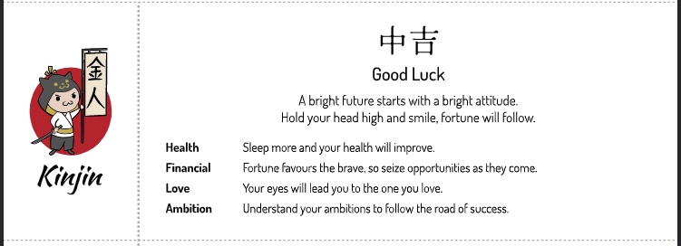

# Fortune Slip Generator

> :construction: The project is still under development. :construction:

With the Fortune Slip Generator, you can create your very own Fortune Slips!

Get the latest version [here](https://github.com/JoostVisser/fortune-slip-generator/releases).

A sample fortune slip looks like this:

The default output of the program is a PDF file, which can be printed on A4 paper.
- Alternating front and back pages
- Each page contains 4 fortune slips, which can be cut out on the dotted line.

## How to fold the fortune slips

First you want to cut the fortune slips out of the paper.

We found out that the best way to fold them is the following:
1. Fold the fortune text in half, such that the right side of the slip touches the dotted line.
2. Fold it in half again the same way.
3. Fold the left part (with the logo) on top of the right part and glue with a glue stick.

This way, you only have to glue once and the fortune text is on the inside of the slip.
Moreover, when unfolding the slip, the fortune text is the first thing you see.

## Getting started
You can download the latest release from the [releases
page](https://github.com/JoostVisser/fortune-slip-generator/releases)

The following needs to be installed on your system:
1. Inkscape
2. Fonts (the default template uses Dosis, Hina Mincho and Kaushan Script)

### Windows installation
#### Step 1: Install Inkscape

Inkscape needs to be installed and added to your PATH. To do this:
1. Download the latest version of Inkscape: https://inkscape.org/release/
2. During the installation, select to add Inkscape to your path

If you get an error (such as Path being too long), you can add Inkscape directory to
your PATH manually:
- Open the start menu and search for "Edit the system environment variables"
- Select "Environment Variables"
- Select "Path" under "System variables" and click on "Edit"
- Select "New" and add the path to Inkscape's `bin` directory (e.g. `C:\Program Files\Inkscape\bin`)

#### Step 2: Install the fonts

To install the fonts:
1. Open the fonts from the `fonts` directory
2. Right click on the font file and select "Install for all users"

### Linux installation

The installation instructions are for Ubuntu/Debian, but other distros should be similar.

1. Install dependencies:
   `sudo apt install inkscape libfontconfig libfontconfig1-dev`
2. Install Fonts
   - Open the fonts from the `fonts` directory
   - Double-click on the font file and click "Install"

## Configuration
### CLI options

The program works without any flags, but the following flags are available:

- `-o`, `--output <FILE>` — Path to the output PDF [default: `fortune_slips.pdf`]
- `-c`, `--config <FILE>` — Custom path to the settings YAML file [default: `fortune_settings.yaml`]
- `-s`, `--skip-checks` — Skip the prerequisites checks
- `-h`, `--help` — Print help

### Changing the template

The program requires an SVG file as a template.

Any SVG file can be used as a template, as long as:
1. `header`, `luck_level` and all categories are present four times.
2. Unique IDs are used for each element.

The templates have been created using Figma, and a `.fig` file can be found in the
`data/figma_templates` directory. Feel free to edit them to your liking, then refer to the
new template in the `settings.yaml`.

In case you use the Figma template, when you export the SVG, ensure you:
- Select 'Include "id" attribute'
- Deselect the "Outline text" option (the text needs to be editable)
